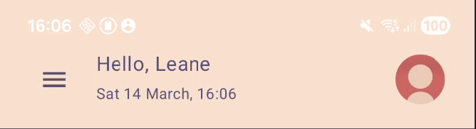
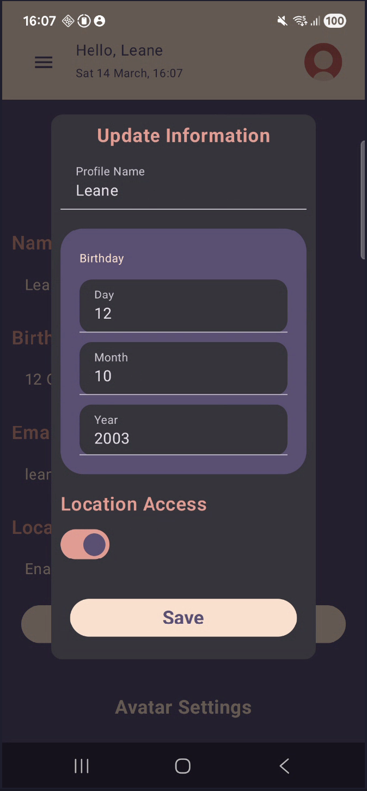
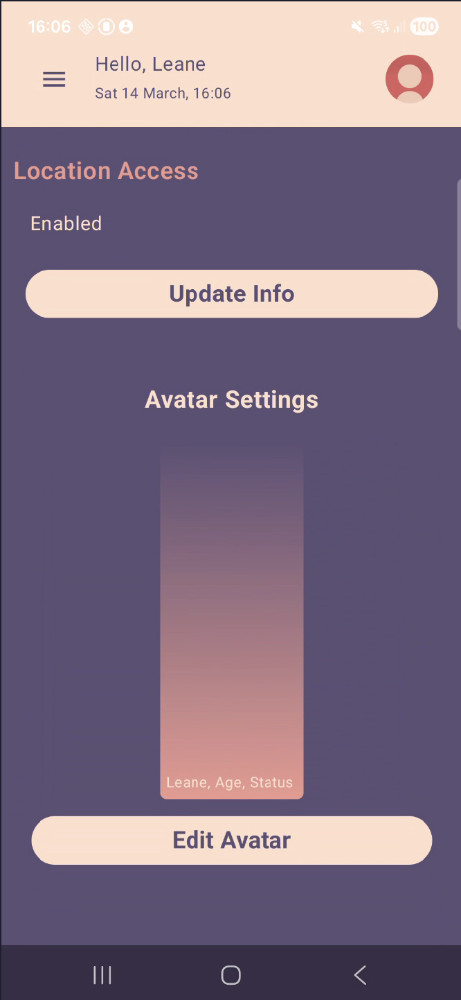

# Final Year Project
## Building a Mobile Application - Star Student

 **Leane Matejko - Supervisor: Susnas Sourjah**

### Pre-requisites
- **Android Phone**
- App_debug.apk (Project Executable) file ->    [Project path - PROJECT/product/app/build/outputs/apk/debug](PROJECT/product/app/build/outputs/apk/debug)
    - No additional downloads are required.
- On you android phone, allow security permissions to be lowered to **allow non-Google Play Apps**
- **Android Version: 16.0** 

### Installation instructions

1. Download App_debug.apk file.
2. Allow non-Google Play apps to run on your phone.
3. Open file from folder.
4. Trust Star Student
5. Ready to go!

### Usage Instructions
- [Sign In and Register](#sign-in-and-register)
- [Profile Settings](#user-profile)

#### Sign In and Register
- Register Account (New User)

    
    

- Sign in using credentials (Returning User)
    
    
    

- Navigate the Homepage

    

- Light and Dark mode (Based on your device setting) 

    
    

#### Profile Settings
- Homepage Reformated

    
 > 
    <ul>
        <li>Widgets have been restructed for clearer results</li>
        <li>Scrolling possible</li>
        <li>Top Banner added for additional navigation</li>
    </ul>
    

- Profile Page
    

    
    <ul>
        <li>Username (Default to user's email)</li>
        <li>Birthday (Default to when the user first signed up)</li>
        <li>Location Access (Default is denied)</li>
        <li>Email (Cannot be changed.)</li>
    </ul>
    

- Top Banner (Navigation to profile page)
    
    

    
    <ul>
        <li>Shows user's chosen username</li>
        <li>Date and Time update to reflect realtime</li>
        <li>Profile picture navigates to profile page</li>
    </ul>
    

- Update profile settings
    
    

    
    <ul>
        <li>Can update username, birthday and location access</li>
        <li>Birthday limited to number input (12/10/2003 -> 12th October 2003)</li>
    </ul>
    

- Avatar setting (Placeholder for future options)
    
    

    
    <ul>
        <li>Placeholder for a future customisable avatar</li>
    </ul>
    
