# Final Year Project
## Building a Mobile Application - Star Student

 **Leane Matejko - Supervisor: Susnas Sourjah**

### Pre-requisites
- **Android Phone**
- App_debug.apk (Project Executable) file ->    [Project path - PROJECT/product/app/build/outputs/apk/debug](PROJECT/product/app/build/outputs/apk/debug)
    - No additional downloads are required.
- On you android phone, allow security permissions to be lowered to **allow non-Google Play Apps**
- **Android Version: 16.0** 

### Installation instructions

1. Download App_debug.apk file.
2. Allow non-Google Play apps to run on your phone.
3. Open file from folder.
4. Trust Star Student
5. Ready to go!

### Usage Instructions
- [Sign In and Register](#sign-in-and-register)
- [Profile Settings](#user-profile)
- [Study Centre](#study-centre)
- [Planner and Task List](#planner-and-task-list)
- [History](#history)
- [Homepage Customisation and Function](#homepage-customisation-and-functions)

#### Sign In and Register
- Register Account (New User)

    
    

- Sign in using credentials (Returning User)
    
    
    

- Navigate the Homepage

    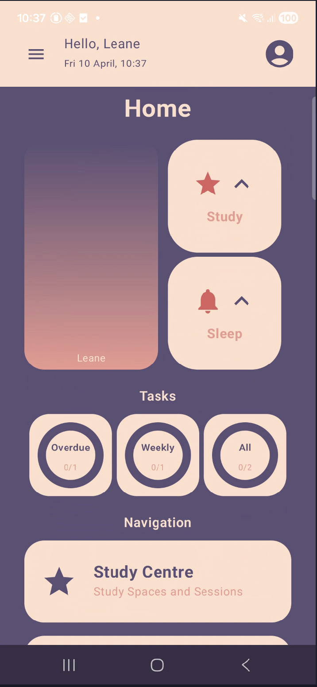

- Light and Dark mode (Based on your device setting) 

    
    

#### Profile Settings
- Homepage Reformated

    
 >  >
    
    <ul>
        <li>Widgets have been restructed for clearer results</li>
        <li>Scrolling possible</li>
        <li>Top Banner added for additional navigation</li>
    </ul>
    

- Profile Page
    

    
    <ul>
        <li>Username (Default to user's email)</li>
        <li>Birthday (Default to when the user first signed up)</li>
        <li>Location Access (Default is denied)</li>
        <li>Email (Cannot be changed.)</li>
    </ul>
    

- Top Banner (Navigation to profile page)
    
    

    
    <ul>
        <li>Shows user's chosen username</li>
        <li>Date and Time update to reflect realtime</li>
        <li>Profile picture navigates to profile page</li>
    </ul>
    

- Update profile settings
    
    

    
    <ul>
        <li>Can update username, birthday and location access</li>
        <li>Birthday limited to number input (12/10/2003 -> 12th October 2003)</li>
    </ul>
    

- Avatar setting (Placeholder for future options)
    
    

    
    <ul>
        <li>Placeholder for a future customisable avatar</li>
    </ul>
    

### Study Centre

- Location Detector (Not Detected)
    
    

    
    <ul>
        <li>This detector takes the user's GPS signal and checked if they are in one of the saved Study Spaces.</li>
        <li>The detector will show 'Not detected' if the user has the location access turned off or is not within a study space.</li>
    </ul>
    

- Location Detector (Detected)
    
    

    
    <ul>
        <li>The detectors label will update to detect if within a study space.</li>
        <li>A study sessios can be automatically started if the user is within a study space for at least 5 minutes.</li>
    </ul>
    

- Saved Locations
    
    

    
    <ul>
        <li>User can save up to 5 locations as their study spaces.</li>
        <li>Each study space has a label that can be updated via the input field.</li>
        <li>Each study space's location can be updated to the user's current location.</li>
        <li>Window cannot be opened if location access is off.</li>

    </ul>
    

- **UPDATED** Study Space Detector
    

    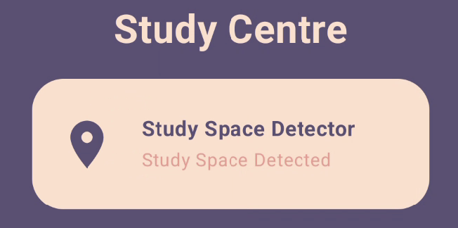
    <ul>
        <li>Icon on the Study Space detector now updated to show if the user is within a study space.</li>

    </ul>
    

- Study Session Window (No Sessions)
    
    

    
    <ul>
        <li>Users can start a study session manuall.</li>
        <li>A study session will be automatically started if the user is within a study space for 5 minutes.</li>
    </ul>
    

- Study Session Window (Current Sessions Active)
    
    

    
    <ul>
        <li>Timer reflects total study time, formatted HH:mm:ss.</li>
        <li>Options to pause.</li>
    </ul>
    

- Study Session Window (Current Sessions Paused)
    
    

    
    <ul>
        <li>Button and sessions timer update to reflect the sessions paused status. </li>
    </ul>
    

- **UPDATED** Study Session Window
    
    

    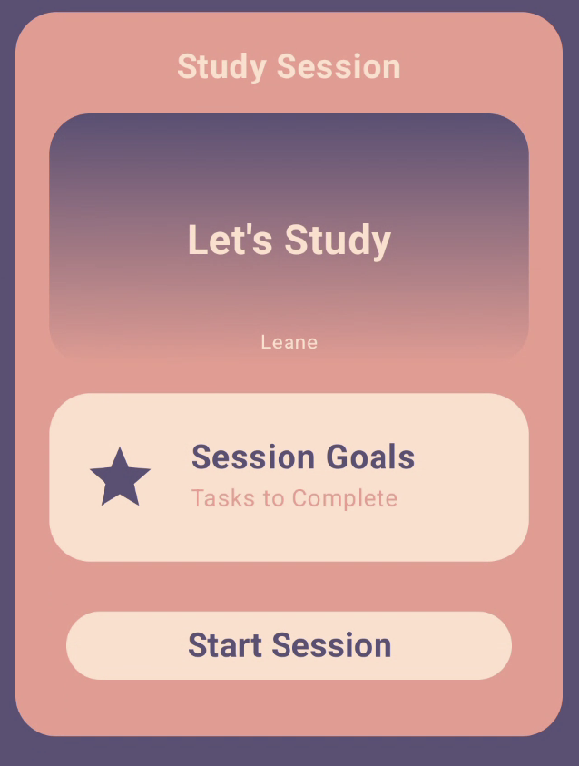
    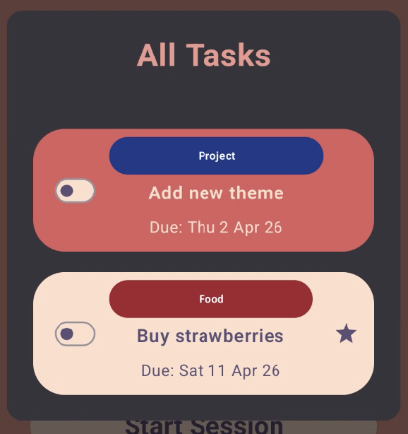
    <ul>
        <li>Study Session window allows for a complete task list to shown for the session goals.</li>
    </ul>
    

- Study Session Tasks
    
    

    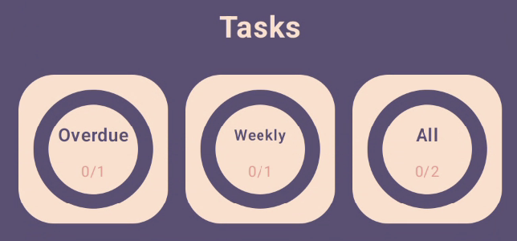
    <ul>
        <li>Shows options for tasks  that are overdue, due for this week, or the complete list.</li>
        <li>Tasks can be marked as complete here</li>
    </ul>
    

- Recent Study Sessions
    
    

    
    <ul>
        <li>Shows the 5 most recent study sessions completed by the user.</li>
        <li>Study Sessions must be over 5 minutes to be shown.</li>
    </ul>
    

### Planner and Task List

- Planner - Calendar View
    
    

    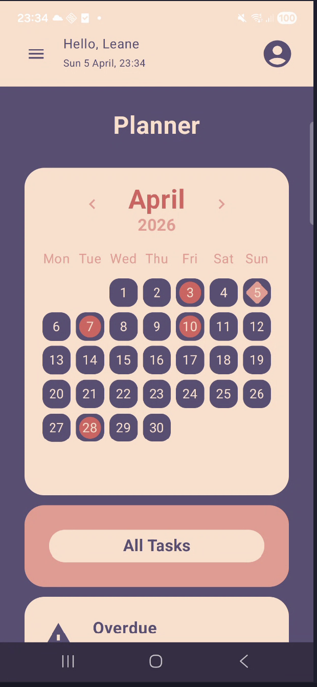
    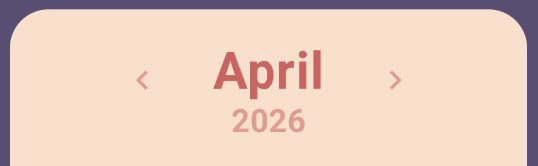
    <ul>
        <li>Calender view of all tasks</li>
        <li>Loads to the current month</li>
        <li>Indicator for the current day (diamond) and days with tasks due (circle)</li>
        <li>Click the month and year at the top to open the selection window </li>
        <li>Options to add tasks to day with or without tasks</li>
    </ul>
    

- Calendar Navigation
    

    
    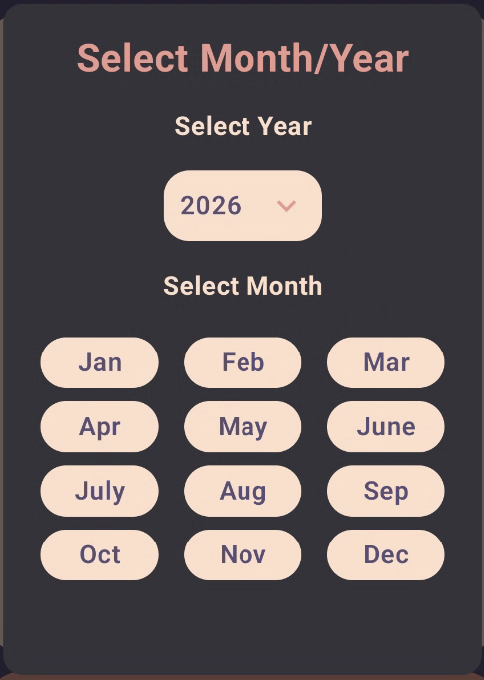
    <ul>
        <li>Navigation possible via the next and previous buttons or clicking on the month and selecting an option</li>
        <li>Possible to select the month or year</li>
        <li>Months can be selected via buttons and the year via a dropdown</li>
        <li>Dismiss the window by clicking outside</li>
    </ul>
    

- Planner - Navigation to Task List
    

    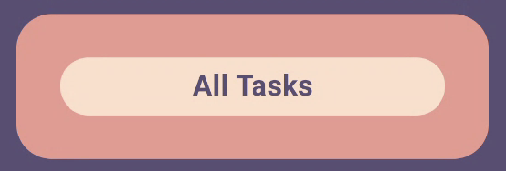
    <ul>
        <li>Navigation to the Task List view, separated into categories.</li>
    </ul>
    

- Planner - Task Catergories
    

    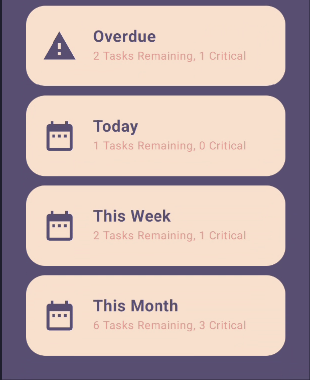
    <ul>
        <li>Shows current tasks in a managble catergories: overdue, weekly, today and this week</li>
        <li>There is an indicator on the widget for the total number of tasks and of which that are critical</li>
    </ul>
    

- Planner - Task Catergories (Examples)
    

    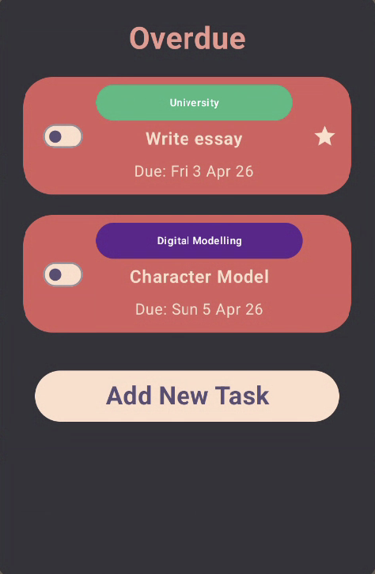
    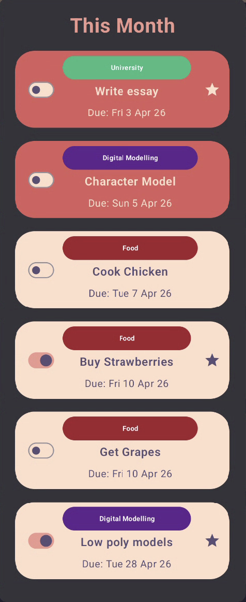
    <ul>
        <li>Examples of the task categories list. Sorted by due dates.</li>
        <li>Overdue tasks are highlighted, and ciritcal tasks have a star indicator.</li>
    </ul>
    

- Task List View
    

    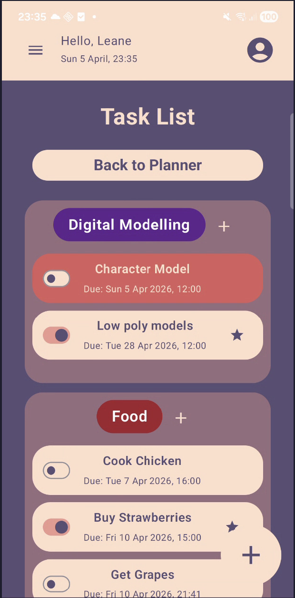
    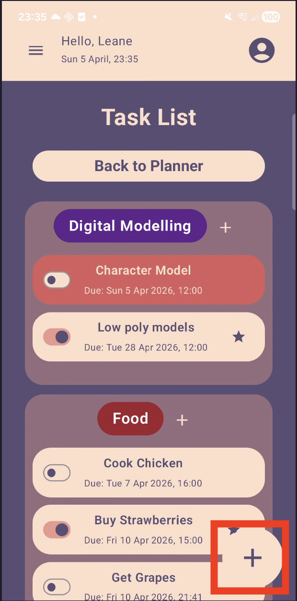
    <ul>
        <li>Shows tasks into their categories, sorted by due date.</li>
        <li>Overdue tasks are highlighted, and ciritcal tasks have a star indicator.</li>
        <li>Categories and tasks can be edited by clicking on the badge</li>
        <li>Tasks can be marked off using the toggle on the left side</li>
        <li>Quick add tasks with the add button on the side of the category or with the add button on the bottom right hand corner</li>
    </ul>
    

- Task List View
    

    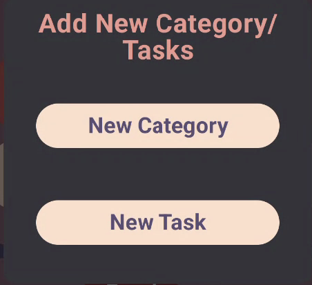
    <ul>
        <li>Window to add a new category or task or readd a hidden category</li>
    </ul>
    

- Task List - Readding Hidden Categories
    

    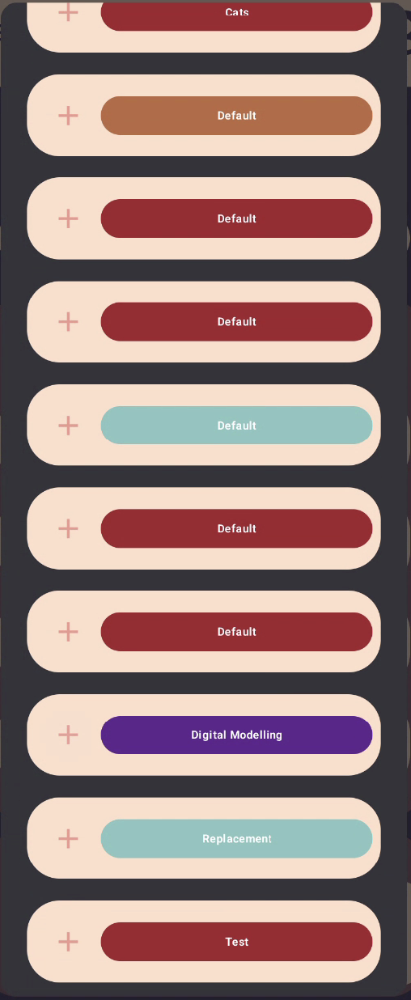
    <ul>
        <li>Hidden categories can be readded to the task list view via the add menu</li>
        <li>Click the plus button on left side to readd the category</li>
    </ul>
    

- Planner - Example of hidden categories reflected on the calendar view
    

    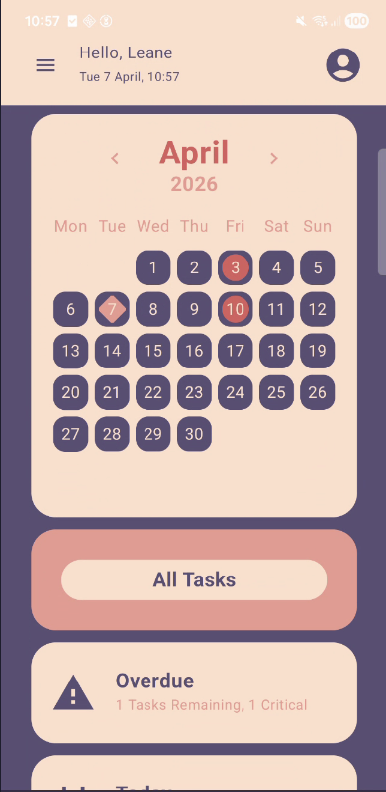
    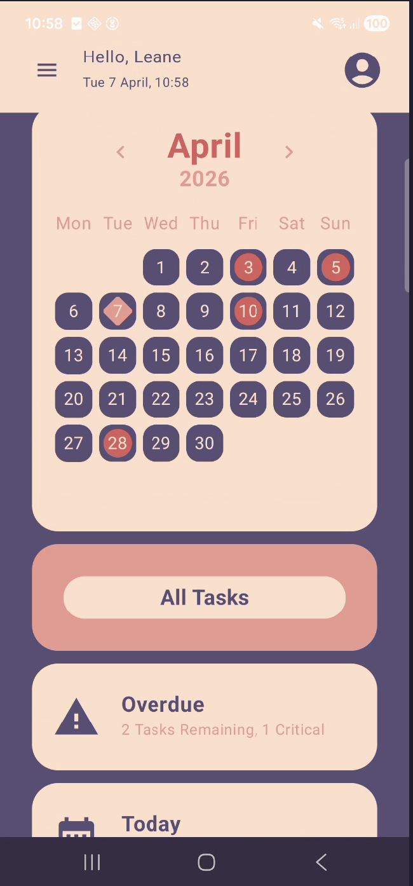
    <ul>
        <li>Calendar with a hidden category [Left], Readded category [Right]</li>
        <li>Tasks will reflect the hidden status of their categories</li>
        <li>Hidden tasks will not be included on the calendar or the dated widgets</li>
    </ul>
    

- Task List - Add New Category
    

    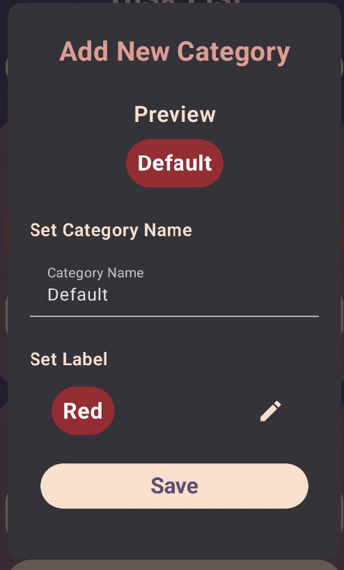
    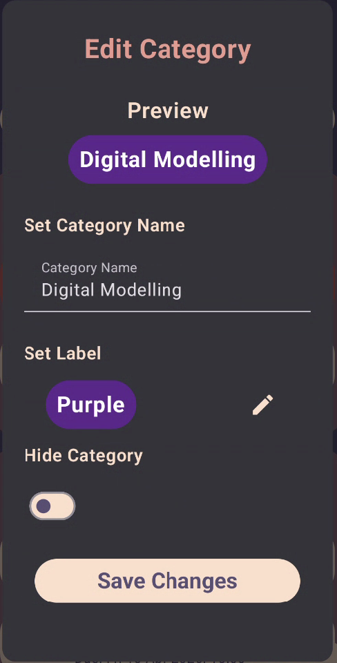
    <ul>
        <li>Window to add a new category</li>
        <li>Shows a preview of with the category badge renders to</li>
        <li>Colour options of red, orange, yellow, green, blue, navy, purple, pink (Adaptive to the light and dark themes)</li>
        <li>Badges can be left to their default and edtted later.</li>
        <li>When in edit mode, categories can be hidden</li>
    </ul>
    

- Task List - Task Item
    

    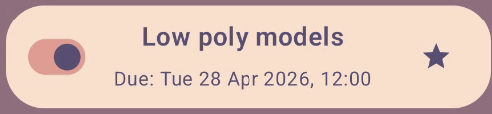
    <ul>
        <li>Tasks are shown under each category</li>
        <li>Each task shows the label, due date, critical status and toggle for the complete status.</li>
        <li>Tasks are edittable by clicking on the widget</li>
    </ul>
    

- Task List - Add New Task
    

    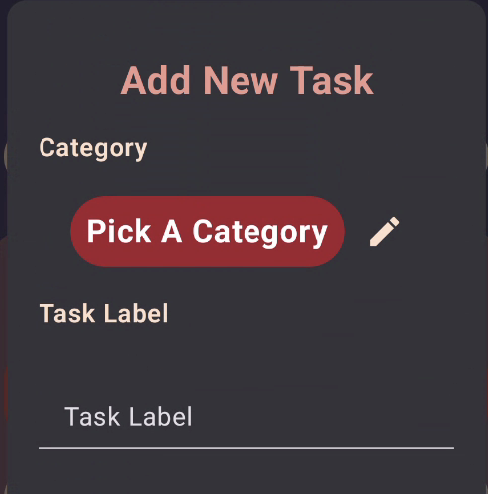
    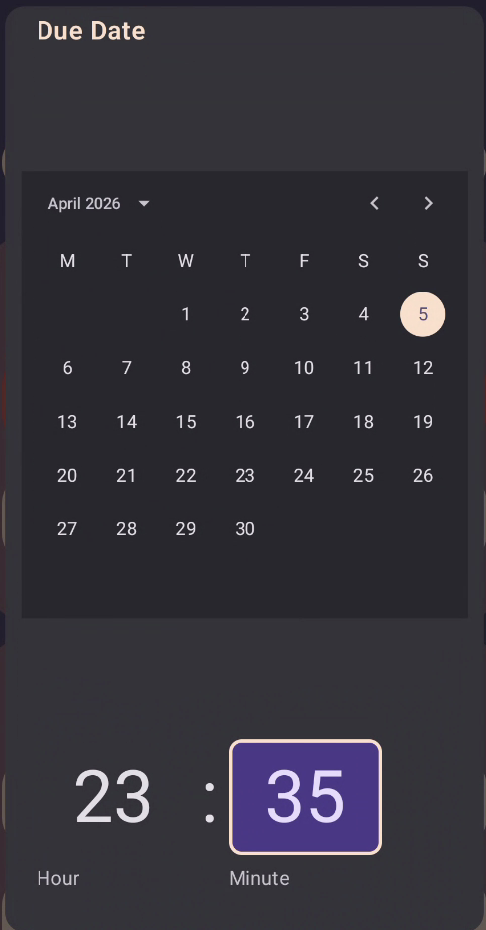
    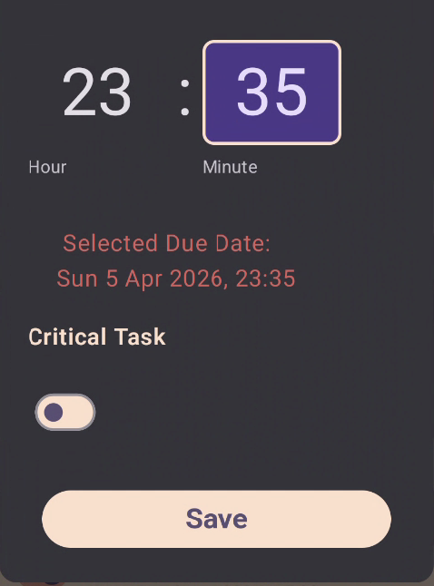
    <ul>
        <li>Options to select the category, label, date, time and critical status</li>
        <li>A category must be selected, otherwise and error is thrown</li>
        <li>Date and time is set to the current date and time as a default</li>
    </ul>
    

- Task List - Edit Task
    

    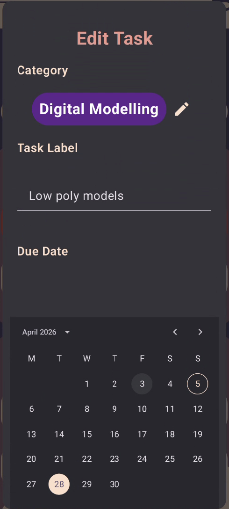
    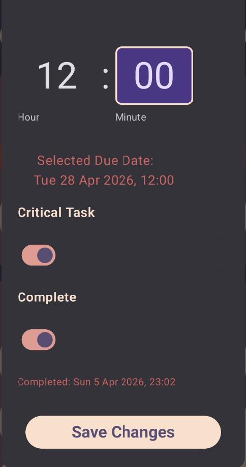
    <ul>
        <li>Options to change the category, label, date, time and critical status and complete a task</li>
        <li>A All currently saved values are loaded into each field</li>
        <li>If the task is complete, the completion date set to the current time</li>
    </ul>
    

### History
- History Page
    

    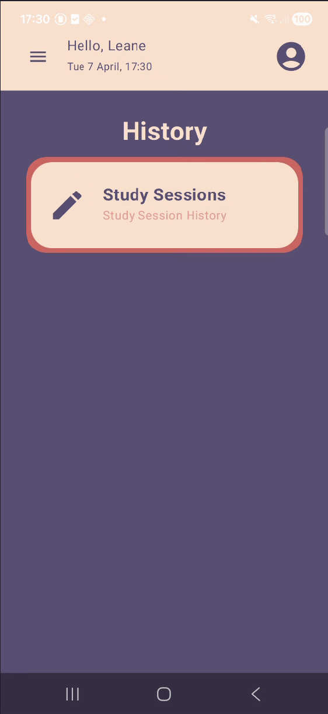
    <ul>
        <li>Shows a database of saved results</li>
        <li>Currently only interacts with study sessions</li>
    </ul>
    

- History Page - Study Sessions
    

    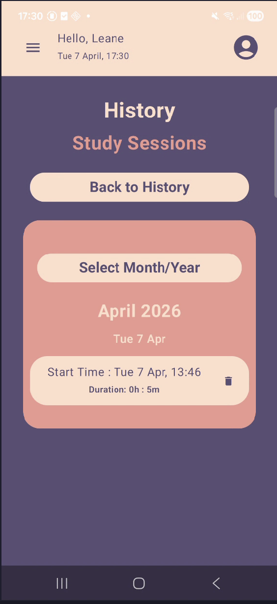
    <ul>
        <li>All study sessions completed within the select month are show</li>
        <li>Current month is set to the default</li>
        <li>Each session will show its start date and time, and the total duration of the session (minus any paused breaks)</li>
        <li>There is an option to delete any sessions</li>
        <li>All sessions are shown here (even if they are less than 5 minutes)</li>
        <li>This is a sub page of the history page and cannot be accessed via the navigation menu</li>
    </ul>
    

- History Page - Month/Year Selection
    

    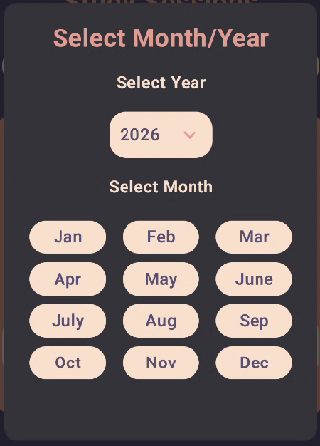
    <ul>
        <li>Options to change the selected month and year</li>
        <li>A Once selected, click out of the window to return to the session history page</li>
    </ul>
    

- History Page - No sessions found
    

    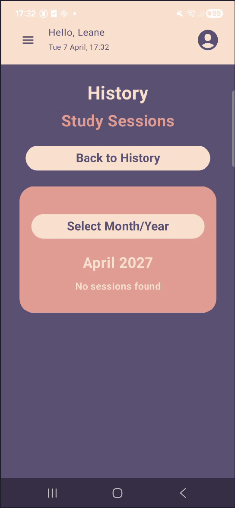
    <ul>
        <li>If there are no sessions found within a specific month, the message "No sessions found" will be shown</li>
    </ul>
    

- History Page - Delete Session
    

    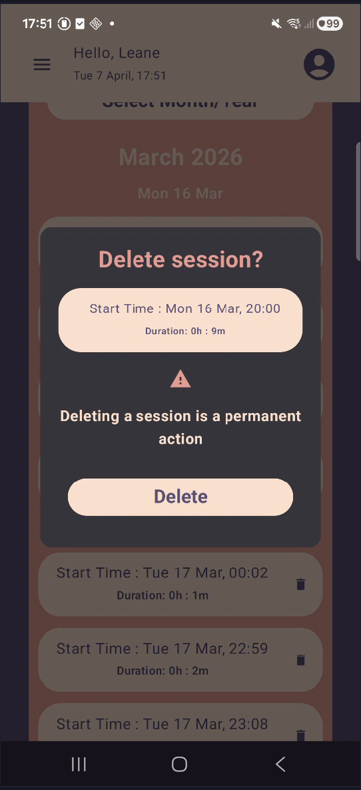
    <ul>
        <li>Session deleteion is permanent and cannot be recovered, so additional window to confirm the action has been added</li>
        <li>The information about the session is shown in the example</li>
        <li>Once delete is pressed, the session and all paused sesssions are deleted</li>
        <li>Dismiss the window to avoid deleting a session</li>
    </ul>
    

### Homepage Customisation and Functions

- New Themes
    

    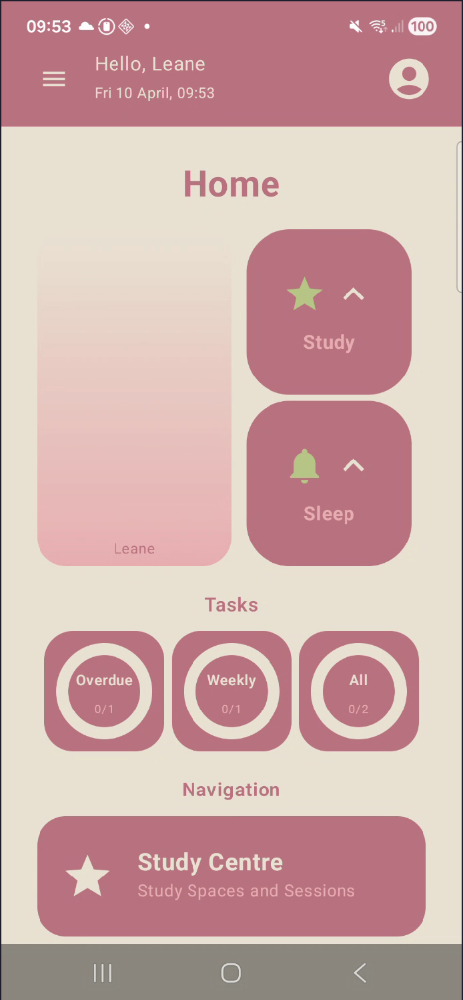
    <ul>
        <li>Users can pick from a number of custom themes that are loaded once logged in</li>
    </ul>
    

- Set themes and theme options
    

    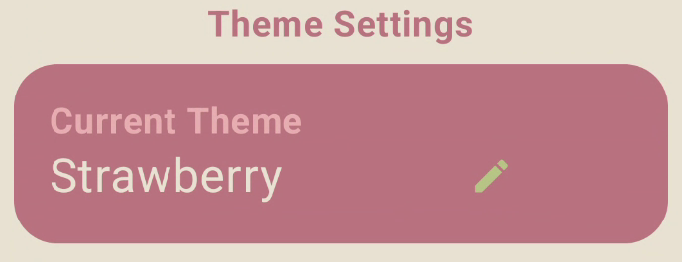
    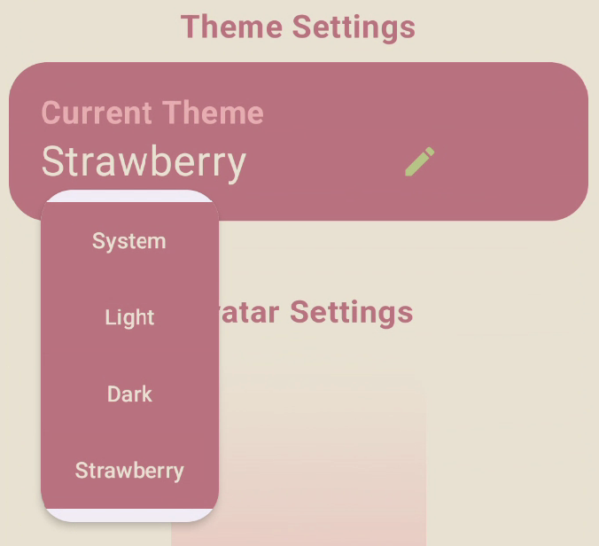
    <ul>
        <li>Users can set theme theme to the options shown in the dropdown menu.</li>
        <li>The 'System' dynamic option reflects the user's phone settings</li>
        <li>All other theme persist statically</li>
    </ul>
    

- Homepage Customisation Options
    

    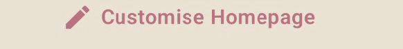
    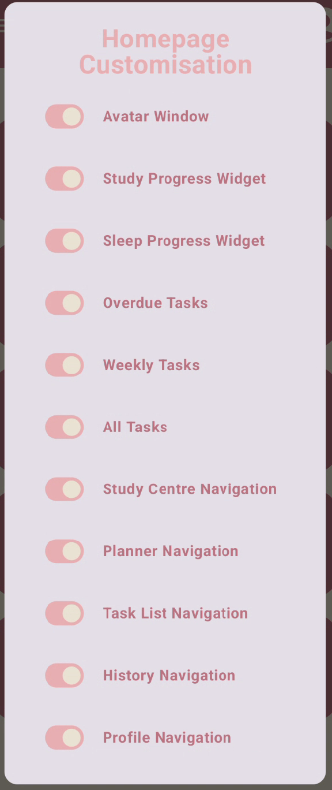
    <ul>
        <li>There are options to choose the specific widget and navigation options that are applicable to the user.</li>
        <li>Open the customise homepage window and toggle the wanted features.</li>
    </ul>
    

- Adaptive Layout
    

    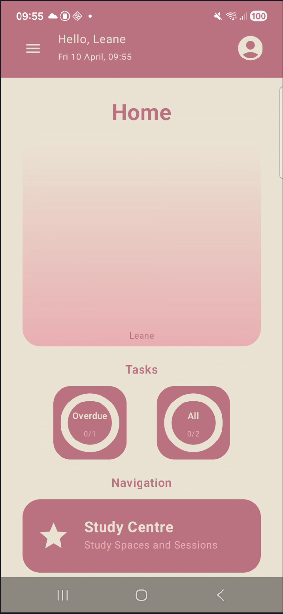
    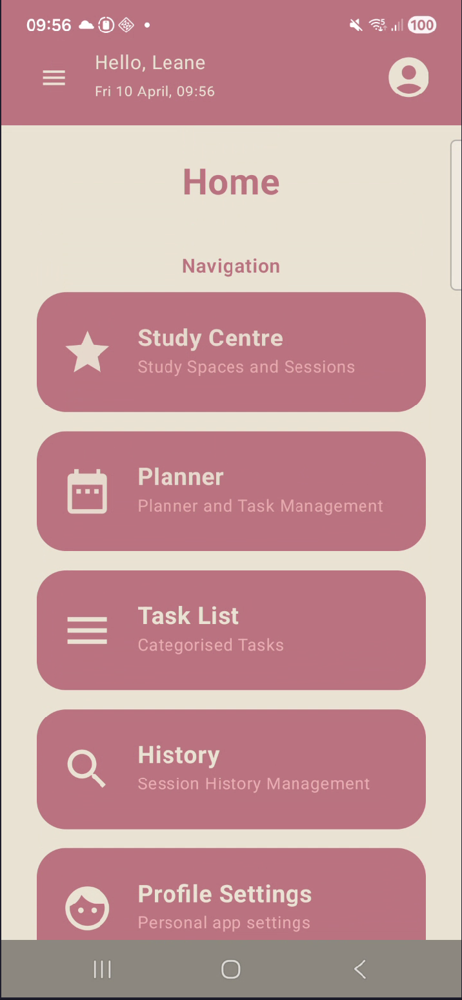
    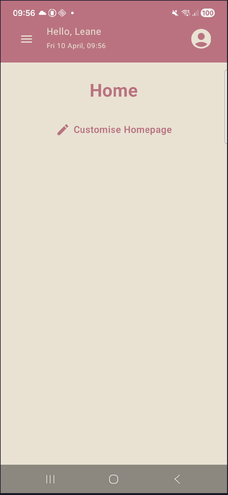
    <ul>
        <li>Session deleteion is permanent and cannot be recovered, so additional window to confirm the action has been added</li>
        <li>The information about the session is shown in the example</li>
        <li>Once delete is pressed, the session and all paused sesssions are deleted</li>
        <li>Dismiss the window to avoid deleting a session</li>
    </ul>
    

- Homepage Study Widget
    

    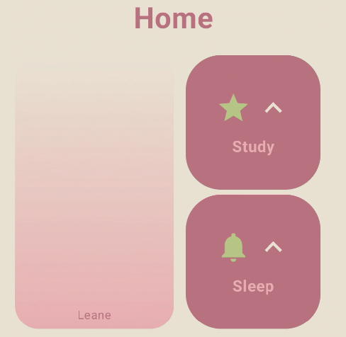
    <ul>
        <li>Show study hours progress (number of total study hours) that week compare to the previous week.</li>
        <li>The avatar window and the study widget is currently a placeholder for future features.</li>
    </ul>
    

- Homepage Tasks
    

    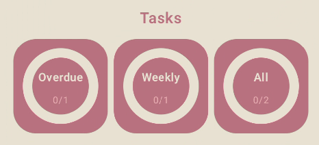
    <ul>
        <li>Shows tasks that are overdue, due in the current week or all tasks.</li>
        <li>Tasks can be marked as complete here</li>
    </ul>
    

- Homepage Navigation
    

    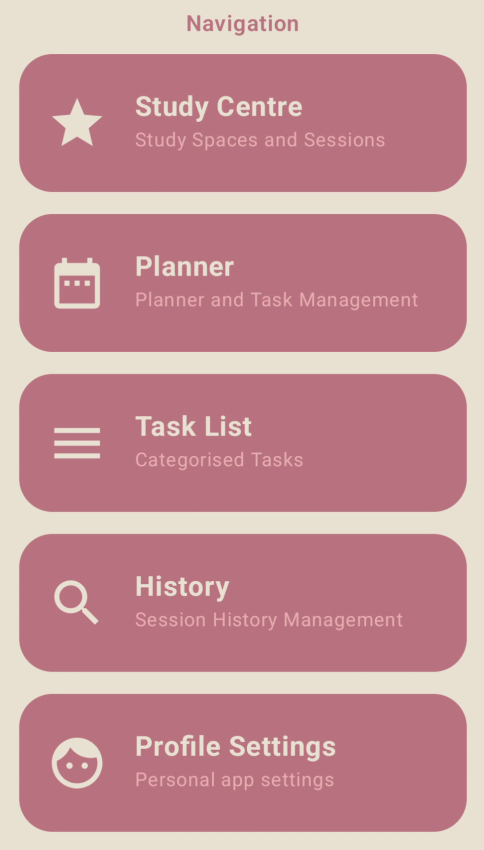
    <ul>
        <li>Provides navigation options to the main features of the app</li>
    </ul>
    

